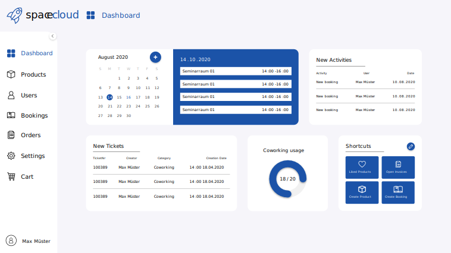

<!-- PROJECT SHIELDS -->
<!--
*** I'm using markdown "reference style" links for readability.
*** Reference links are enclosed in brackets [ ] instead of parentheses ( ).
*** See the bottom of this document for the declaration of the reference variables
*** for contributors-url, forks-url, etc. This is an optional, concise syntax you may use.
*** https://www.markdownguide.org/basic-syntax/#reference-style-links
-->

[![Contributors][contributors-shield]][contributors-url]
[![Stargazers][stars-shield]][stars-url]
[![Issues][issues-shield]][issues-url]
[![MIT License][license-shield]][license-url]

<!-- PROJECT LOGO -->
 

  

<h3 align="center">SpaceCloud</h3>

  

     The perfect ERP System for your Coworking!
     
    <a href="resources/Projektmappe_SpaceCloud.pdf"><strong>Explore the docs »</strong></a>
     
     
    <a href="https://github.com/naendo/spacecloud">View Demo</a>
    ·
    <a href="https://github.com/naendo/spacecloud/issues">Report Bug</a>
    ·
    <a href="https://github.com/naendo/spacecloud/issues">Request Feature</a>
  

<!-- ABOUT THE PROJECT -->
## About The Project

SpaceCloud was developed in cooperation with the company **Consolidate GmbH & Co KG**, to create an easy solution for managing their in-house coworking.

The aim of SpaceCloud is to minimize the workload a typical coworking operator must go through. It is very easy for said operator to digitize his coworking by creating their products in the program. In addition to that, they will get regular information about the current ongoings in their dashboard.

The coworkers can create an account on the specific coworking sub-domain in order to book the company´s products. _**Customer X** can access webshop on **github.spacecloud.cc**_

Furthermore, SpaceCloud has an included billing system, which generates an invoice and sends it to the customer as soon as an order has been confirmed by an administrator.

## Built With

To build a well-rounded system we decided to go with
* [ASP.NET Core](https://docs.microsoft.com/en-us/aspnet/core/?view=aspnetcore-5.0) - Backend
* [PostgreSQL](https://www.postgresql.org) - Database
* [Vue.JS](https://vuejs.org) - Frontend

## Contact
Project Link: [https://github.com/naendo/spacecloud](https://github.com/naendo/spacecloud)

<!-- ACKNOWLEDGEMENTS -->
## Acknowledgements

* [SignalR](https://dotnet.microsoft.com/apps/aspnet/signalr)
* [Microsoft Blob Storage](https://azure.microsoft.com/en-us/services/storage/blobs/?&ef_id=Cj0KCQjw7MGJBhD-ARIsAMZ0eeuJMwc1JZQo00tY59Tc6TLhu58_onJrBG5HjCWRI4kW6GwTaiH5VEAaAjMmEALw_wcB:G:s&OCID=AID2200147_SEM_Cj0KCQjw7MGJBhD-ARIsAMZ0eeuJMwc1JZQo00tY59Tc6TLhu58_onJrBG5HjCWRI4kW6GwTaiH5VEAaAjMmEALw_wcB:G:s&gclid=Cj0KCQjw7MGJBhD-ARIsAMZ0eeuJMwc1JZQo00tY59Tc6TLhu58_onJrBG5HjCWRI4kW6GwTaiH5VEAaAjMmEALw_wcB)
* [Digital Ocean](https://www.digitalocean.com/try/developerbrand-nofto?utm_campaign=emea_brand-no-ftonew_kw_en_cpc&utm_adgroup=digitalocean_exact_exact&_keyword=digital%20ocean&_device=c&_adposition=&utm_content=conversion&utm_medium=cpc&utm_source=google&gclid=Cj0KCQjw7MGJBhD-ARIsAMZ0eeumRxOgSbzcqeqHiXKcCy7RleXmJSQsMeHhmiUYMm6QIDPcvucMhZsaAh8zEALw_wcB)
* [SendGrid](https://sendgrid.com)

<!-- MARKDOWN LINKS & IMAGES -->
<!-- https://www.markdownguide.org/basic-syntax/#reference-style-links -->

[contributors-shield]: https://img.shields.io/github/contributors/naendo/spacecloud.svg?style=for-the-badge

[contributors-url]: https://github.com/naendo/spacecloud/graphs/contributors

[forks-shield]: https://img.shields.io/github/forks/naendo/spacecloud.svg?style=for-the-badge

[forks-url]: https://github.com/naendo/spacecloud/network/members

[stars-shield]: https://img.shields.io/github/stars/naendo/spacecloud.svg?style=for-the-badge

[stars-url]: https://github.com/naendo/spacecloud/stargazers

[issues-shield]: https://img.shields.io/github/issues/naendo/spacecloud.svg?style=for-the-badge

[issues-url]: https://github.com/naendo/spacecloud/issues

[license-shield]: https://img.shields.io/github/license/naendo/spacecloud.svg?style=for-the-badge

[license-url]: https://github.com/naendo/spacecloud/blob/master/LICENSE.txt

[linkedin-shield]: https://img.shields.io/badge/-LinkedIn-black.svg?style=for-the-badge&logo=linkedin&colorB=555

[linkedin-url]: https://linkedin.com/in/naendo
